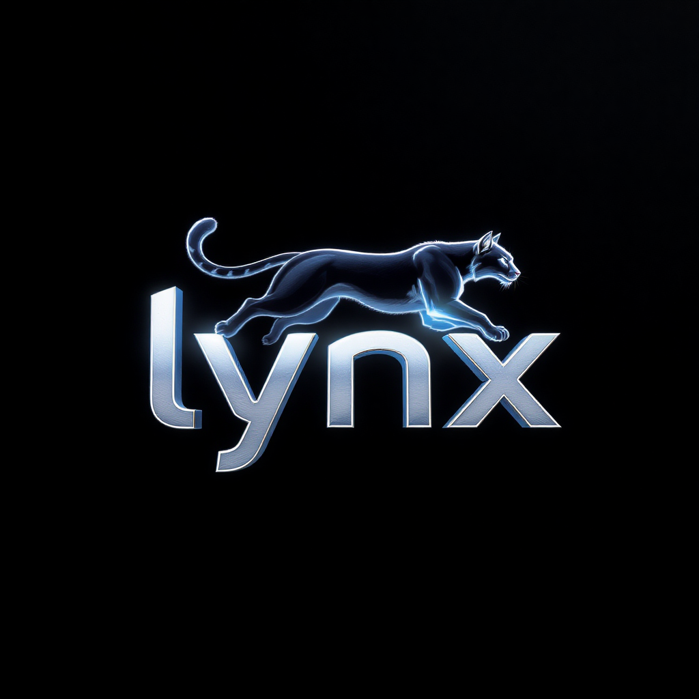



# Lynx - ThreatHunter Pro

**Browser-based file triage and threat analysis platform**

[](https://opensource.org/licenses/MIT)
[](https://github.com/servais1983/Lynx)
[](https://developer.mozilla.org/en-US/docs/Web/JavaScript)

---

## Table of Contents

- [Overview](#overview)
- [Features](#features)
- [Analysis Engines](#analysis-engines)
- [Installation](#installation)
- [Usage](#usage)
- [Configuration](#configuration)
- [Architecture](#architecture)
- [Security Model](#security-model)
- [Contributing](#contributing)
- [License](#license)

---

## Overview

Lynx is a client-side file triage tool designed for security analysts and incident responders. It combines static heuristic analysis, YARA-compatible pattern matching, real SHA-256 hashing, VirusTotal API v3 lookups, and in-browser LLM zero-shot classification to produce a composite threat score for any submitted file — without uploading content to any backend.

All analysis runs entirely in the browser. No file bytes leave the user's machine unless the user explicitly configures a VirusTotal API key for hash lookups.

---

## Features

### Threat Analysis
- Multi-engine scoring with weighted composite risk score (0-100)
- Real SHA-256 file hashing using the Web Crypto API
- Shannon entropy calculation to detect packed or encrypted payloads
- Static heuristic analysis: injection APIs, evasion techniques, persistence mechanisms, crypto APIs, shell execution patterns, keylogger calls, ransom-related strings, obfuscation indicators
- YARA-compatible pattern engine scanning actual file content (10 rule categories)
- VirusTotal API v3 hash lookup with per-engine detection breakdown

### AI / LLM Integration
- Zero-shot text classification using **Transformers.js** (`Xenova/nli-deberta-v3-small`)
- Runs as an ONNX quantized model directly in the browser via WebAssembly — no server required
- Classifies file content against: malware, ransomware, trojan, backdoor, keylogger, benign
- LLM result (45% weight) blended with heuristic score (55% weight)
- Graceful degradation: if the model cannot load, heuristic-only mode activates automatically

### File Handling
- Drag-and-drop and file picker upload
- ZIP archive extraction with recursive analysis of contained files
- Batch processing with progress tracking
- Automated triage: directory scanning, suspicious file copy-out

### Security
- API keys encrypted at rest with AES-256-GCM (Web Crypto API)
- Stable per-installation encryption key derived via PBKDF2 (210 000 iterations, SHA-256)
- Rate limiting for VirusTotal requests (4 req/min, free tier compliant)
- Security audit log stored in localStorage, capped at 1 000 entries

### Reporting and Visualisation
- Interactive charts: bar, pie, timeline (Chart.js)
- Exportable analysis reports (PDF/JSON)
- Real-time progress indicators
- Detailed per-file breakdown with evidence list

---

## Analysis Engines

| Engine | Technology | Type |
|---|---|---|
| SHA-256 Hash | Web Crypto API | Real |
| VirusTotal Lookup | VirusTotal API v3 | Real |
| Shannon Entropy | In-browser computation | Real |
| Static Heuristics | Custom rule engine | Real |
| YARA Patterns | In-browser pattern scan | Real |
| ML Zero-shot LLM | Transformers.js / nli-deberta-v3-small | Real |
| Signature Database | Local pattern DB | Real |

---

## Installation

### Prerequisites

- A modern browser (Chrome 112+, Firefox 115+, Edge 112+) with WebAssembly support
- Python 3.7+ or Node.js 18+ to serve static files locally
- A VirusTotal API key (free tier at https://www.virustotal.com/gui/join-us)

### Quick Start

```bash
git clone https://github.com/servais1983/Lynx.git
cd Lynx
npm install
npm run dev
```

Then open `http://localhost:5173` in your browser.

### Production Build

```bash
npm run build
npm run preview
```

### Without Node.js

```bash
cd Lynx
python -m http.server 3786
```

Open `http://localhost:3786`.

---

## Usage

### File Analysis

1. Open Lynx in the browser.
2. Drag and drop files onto the upload zone, or click "Select Files".
3. Analysis starts automatically. Each file passes through all enabled engines.
4. Click a result row to view the full evidence breakdown, SHA-256 hash, entropy, YARA matches, and LLM classification.

### Configuring the VirusTotal API Key

1. Click "Manage API Keys" in the toolbar.
2. Select "VirusTotal" from the service list.
3. Enter your API key and click "Save". The key is encrypted with AES-256-GCM before being stored in localStorage.
4. To verify: the key preview (first 8 characters) is displayed in the key manager.

### ZIP Archive Analysis

Lynx automatically detects ZIP archives and recursively analyses their contents. Each contained file is scored individually. Files classified as suspicious or threat are flagged for copy-out.

### Directory Triage (Automation)

1. Click "Select Directory" and choose a local folder.
2. Set a destination path for suspicious file copy-out.
3. Click "Start". Lynx processes all files in the directory and generates a summary report.

### Adding Custom Pattern Rules

Edit `js/yara-rules.js` to add a new rule to the `YARA_RULES` object:

```javascript
my_custom_rule: {
    name: 'My Custom Rule',
    patterns: ['pattern_one', 'pattern_two', 'pattern_three'],
    description: 'Description of what this rule detects'
}
```

Severity is calculated automatically based on the ratio of matched to total patterns.

---

## Configuration

### Risk Score Thresholds

Defined in `js/config.js`:

| Level | Score Range | Action |
|---|---|---|
| SAFE | 0 – 14 | No action required |
| LOW | 15 – 34 | Monitor if deployed |
| MEDIUM | 35 – 59 | Manual review recommended |
| HIGH | 60 – 79 | Do not execute |
| CRITICAL | 80 – 100 | Quarantine immediately |

### LLM Model

The default model is `Xenova/nli-deberta-v3-small` (~86 MB, downloaded from the Hugging Face CDN on first use and cached by the browser). To use a different model, change the model identifier in `js/ai-engine.js`:

```javascript
_pipelinePromise = pipeline(
    'zero-shot-classification',
    'Xenova/nli-deberta-v3-small', // replace with another Xenova-compatible model
    { quantized: true }
);
```

---

## Architecture

### Project Structure

```
Lynx/
├── index.html                    # Application shell
├── css/
│   ├── styles.css               # Core styles
│   ├── enhanced-styles.css      # Extended UI components
│   └── themes.css               # Colour themes
├── js/
│   ├── lynx.js                  # Main orchestrator
│   ├── config.js                # Centralised configuration
│   ├── ai-engine.js             # Transformers.js LLM engine
│   ├── ml-models.js             # Static heuristic models
│   ├── yara-rules.js            # YARA-compatible pattern engine
│   ├── real-yara-rules.js       # Extended rule signatures
│   ├── virustotal-api.js        # VirusTotal API v3 client
│   ├── secure-api-manager.js    # AES-256-GCM key management
│   ├── signature-database.js    # Local signature DB
│   ├── zip-processor.js         # Archive handling
│   ├── triage-automation.js     # Directory triage
│   ├── pattern-searcher.js      # Custom pattern search
│   ├── ui-manager.js            # UI state management
│   ├── report-generator.js      # Report export
│   ├── security-manager.js      # Auth and audit trail
│   ├── compliance-manager.js    # GDPR/ISO27001 checks
│   ├── local-database.js        # IndexedDB persistence
│   ├── analysis-worker.js       # Web Worker offloading
│   ├── rest-api.js              # REST API interface
│   └── plugin-system.js         # Plugin architecture
├── sw.js                         # Service Worker (PWA cache)
├── package.json
└── vite.config.js
```

### Technology Stack

| Layer | Technology |
|---|---|
| Frontend | HTML5, CSS3, JavaScript ES2022+ |
| LLM Inference | Transformers.js v2 (Xenova), ONNX Runtime Web |
| Hashing/Crypto | Web Crypto API (native browser) |
| Visualisation | Chart.js, Three.js |
| Archive handling | JSZip |
| Build | Vite 5, Terser |
| Storage | IndexedDB, localStorage |
| PWA | Service Worker, vite-plugin-pwa |

### Analysis Pipeline

```
File input
    -> SHA-256 hash (Web Crypto)
    -> VirusTotal API v3 lookup (if key configured)
    -> YARA pattern scan (full file content)
    -> Static heuristic scoring (entropy + API pattern matching)
    -> Transformers.js LLM zero-shot classification
    -> Composite risk score (weighted blend)
    -> Result stored and rendered
```

---

## Security Model

### API Key Storage

Keys are never stored in plain text. The storage flow is:

1. A random 256-bit master key is generated on first run and persisted in localStorage as `lynx_master_key`. Every subsequent session reuses this key — API keys are therefore readable across sessions.
2. Each API key is encrypted with AES-256-GCM using a key derived from the master key via PBKDF2 (SHA-256, 210 000 iterations, installation-unique salt).
3. The IV is prepended to the ciphertext before Base64 encoding.

**Note:** localStorage is accessible to any JavaScript running on the same origin. Users should not run Lynx as a shared hosted service without additional origin isolation.

### Data Privacy

- No file content is transmitted to any external server.
- VirusTotal lookups send only the SHA-256 hash of the file.
- The LLM runs entirely in-browser via WebAssembly.
- Analysis results are stored only in the user's browser (IndexedDB / localStorage).

---

## Contributing

Bug reports and pull requests are welcome at https://github.com/servais1983/Lynx/issues.

### Development Setup

```bash
git clone https://github.com/servais1983/Lynx.git
cd Lynx
npm install
npm run dev
```

### Code Standards

- ES2022+ with `async/await` throughout
- No `Math.random()` in analysis logic — all scoring must be deterministic
- New analysis rules must scan actual file content, not filenames or MIME types
- Each engine must fail gracefully and not break the analysis pipeline

---

## License

MIT License — see [LICENSE](LICENSE) for details.

---

## Acknowledgements

Inspired by the file triage work of Xavier Mertens. YARA rule patterns adapted from the public YARA-Rules repository. LLM inference powered by the Xenova/Transformers.js project (Hugging Face).
