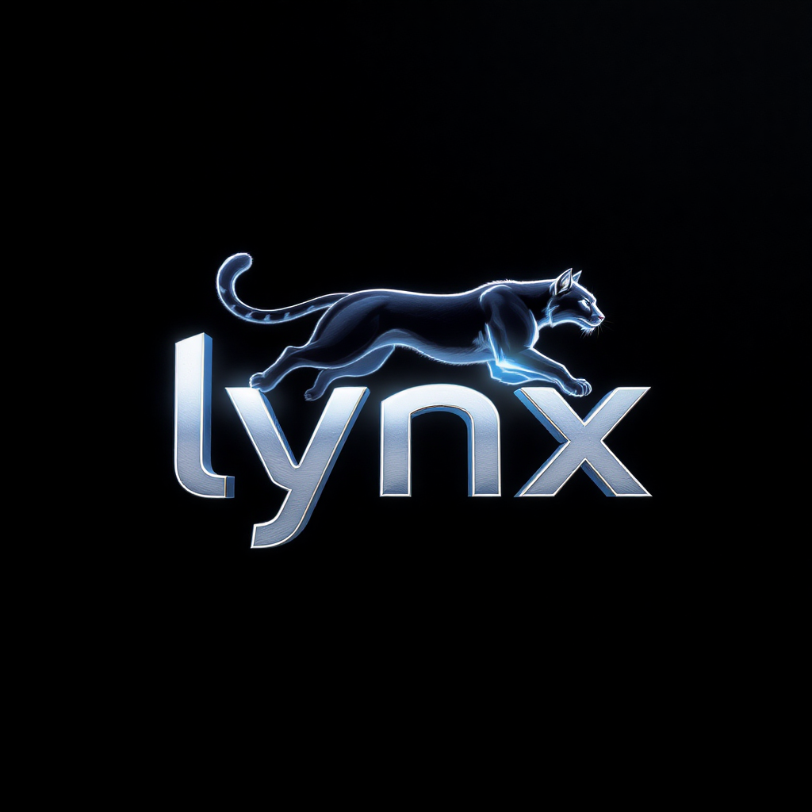

# 🦊 Lynx - ThreatHunter Pro

**Outil de triage de fichiers avec IA et analyse avancée**

[](https://opensource.org/licenses/MIT)
[](https://github.com/servais1983/Lynx)
[](https://www.python.org/)
[](https://developer.mozilla.org/en-US/docs/Web/JavaScript)

## 📋 Table des Matières

- [🎯 Vue d'ensemble](#-vue-densemble)
- [🚀 Fonctionnalités](#-fonctionnalités)
- [🛠️ Installation](#️-installation)
- [📖 Utilisation](#-utilisation)
- [🔧 Configuration](#-configuration)
- [📊 Architecture](#-architecture)
- [🤝 Contribution](#-contribution)
- [📄 Licence](#-licence)
- [🙏 Remerciements](#-remerciements)

## 🎯 Vue d'ensemble

Lynx est un outil de triage de fichiers ultra-moderne qui combine l'intelligence artificielle, l'analyse comportementale et les techniques de détection avancées pour identifier et analyser les menaces potentielles dans vos fichiers.

### ✨ Points forts

- **Interface glassmorphique** avec animations 3D
- **Analyse multi-moteurs** (VirusTotal, YARA, signatures, ML)
- **Traitement ZIP intelligent** avec extraction automatique
- **Automatisation du triage** pour les répertoires entiers
- **IA TensorFlow & Phi-3** pour l'analyse comportementale
- **Visualisations temps réel** avec graphiques interactifs
- **Architecture DevSecOps** avec sécurité renforcée

## 🚀 Fonctionnalités

### 🔐 Sécurité Renforcée (Nouveau)
- **Gestion sécurisée des clés API** : Chiffrement AES-256-GCM des clés API
- **Interface de gestion des clés** : Ajout/modification des clés API via l'interface
- **Validation avancée des fichiers** : Analyse par magic numbers et signatures
- **Système de build moderne** : Optimisation et minification automatique
- **Configuration unifiée** : Centralisation de toutes les configurations

### 🔍 Analyse Avancée

### 🔍 Analyse Avancée
- **VirusTotal Integration** : Analyse en temps réel avec l'API VirusTotal
- **YARA Rules** : Règles de détection personnalisables et étendues
- **Signature Database** : Base de signatures locale pour la détection
- **Pattern Matching** : Recherche de patterns spécifiques et personnalisés
- **Machine Learning** : Classification automatique avec TensorFlow.js et Phi-3

### 📦 Traitement ZIP Intelligent
- **Extraction automatique** des archives ZIP
- **Analyse récursive** du contenu extrait
- **Détection de menaces** dans les fichiers compressés
- **Copie sélective** des fichiers suspects

### 🤖 Automatisation du Triage
- **Sélection de répertoires** réels pour l'analyse
- **Traitement en lot** de fichiers multiples
- **Copie automatique** des fichiers correspondants
- **Rapports détaillés** avec statistiques complètes

### 📊 Visualisations Temps Réel
- **Graphiques en barres** : Répartition des menaces
- **Graphiques en camembert** : Pourcentages par type
- **Timeline** : Évolution des risques dans le temps
- **Changement interactif** de type de visualisation

### 🛡️ Sécurité DevSecOps
- **Chiffrement AES-256-GCM** pour les données sensibles
- **Rate limiting** pour prévenir les abus
- **Audit trail** complet des actions
- **Conformité GDPR/ISO27001** intégrée
- **Architecture Zero-Trust** avec isolation des processus

### 🧠 Intelligence Artificielle
- **TensorFlow.js** : Modèles de détection comportementale
- **Phi-3** : Classification avancée des menaces
- **Score de risque dynamique** basé sur l'IA
- **Recommandations intelligentes** pour l'analyse

## 🛠️ Installation

### Prérequis
- Python 3.7+
- Navigateur web moderne (Chrome, Firefox, Safari, Edge)
- Connexion Internet (pour VirusTotal API)

### Installation rapide

1. **Cloner le repository**
```bash
git clone https://github.com/servais1983/Lynx.git
cd Lynx
```

2. **Installer les dépendances**
```bash
npm install
```

3. **Lancer Lynx en mode développement**
```bash
npm run dev
```

4. **Ou construire pour la production**
```bash
npm run build
npm run preview
```

5. **Ouvrir dans le navigateur**
```
http://localhost:3786
```

### Installation manuelle

Si vous n'avez pas npm, vous pouvez utiliser Python directement :

```bash
cd Lynx
python -m http.server 3786
```

Puis ouvrez `http://localhost:3786` dans votre navigateur.

## 📖 Utilisation

### 🎯 Démarrage rapide

1. **Ouvrez Lynx** dans votre navigateur
2. **Glissez-déposez** vos fichiers dans la zone d'upload
3. **Attendez l'analyse** automatique
4. **Consultez les résultats** dans le panneau de droite
5. **Cliquez sur un fichier** pour voir les détails complets

### 🔍 Analyse de fichiers

#### Glisser-déposer
- Glissez vos fichiers directement dans la zone d'upload
- Support de tous les types de fichiers (EXE, ZIP, DOC, PDF, etc.)
- Analyse automatique avec tous les moteurs

#### Sélection manuelle
- Cliquez sur "📂 Sélectionner des fichiers"
- Choisissez vos fichiers dans l'explorateur
- L'analyse démarre automatiquement

### 🤖 Automatisation du triage

1. **Sélectionnez un répertoire source**
   - Cliquez sur "📁 Sélectionner Répertoire"
   - Choisissez le dossier à analyser

2. **Configurez la destination**
   - Spécifiez le répertoire de destination
   - Les fichiers suspects y seront copiés

3. **Lancez l'automatisation**
   - Cliquez sur "🚀 Démarrer"
   - Suivez la progression en temps réel

4. **Consultez le rapport**
   - Cliquez sur "📋 Rapport" pour les détails
   - Analysez les statistiques complètes

### 🔑 Gestion des clés API (Nouveau)

#### Ajouter une clé API VirusTotal
1. Cliquez sur le bouton "🔑 Gérer les Clés API" dans l'interface
2. Entrez votre clé API VirusTotal dans le champ correspondant
3. Cliquez sur "Sauvegarder"
4. La clé sera chiffrée et stockée localement

#### Vérifier les clés API
- Consultez l'état de vos clés API dans le gestionnaire
- Les clés sont chiffrées avec AES-256-GCM
- Aucune clé n'est stockée en clair

### 🎨 Gestion des patterns

#### Ajouter un pattern personnalisé
1. Entrez le **nom** du pattern
2. Spécifiez la **valeur** à rechercher
3. Choisissez le **niveau de sévérité**
4. Cliquez sur "➕ Ajouter"

#### Rechercher des patterns
1. Entrez le pattern dans le champ de recherche
2. Cliquez sur "🔍 Rechercher"
3. Consultez les résultats dans la liste

### 📊 Visualisations

#### Changer le type de graphique
- Cliquez sur "🔄 Changer Type" dans le panneau de visualisation
- Trois types disponibles :
  - **Barres** : Vue classique avec pourcentages
  - **Camembert** : Vue circulaire avec étiquettes
  - **Timeline** : Évolution chronologique des risques

## 🔧 Configuration

### Configuration VirusTotal

**⚠️ IMPORTANT : Vous devez fournir votre propre clé API VirusTotal**

Pour utiliser l'API VirusTotal, vous devez :

1. **Obtenir une clé API gratuite** sur [VirusTotal](https://www.virustotal.com/gui/join-us)
2. **Ajouter votre clé API** via l'interface Lynx :
   - Cliquez sur le bouton "🔑 Gérer les Clés API" dans l'interface
   - Entrez votre clé API VirusTotal
   - La clé sera chiffrée et stockée localement

**Note de sécurité** : Aucune clé API n'est incluse dans ce repository pour des raisons de sécurité. Chaque utilisateur doit fournir sa propre clé.

### Configuration YARA

Les règles YARA sont définies dans `js/yara-rules.js`. Vous pouvez ajouter vos propres règles :

```javascript
const customRules = [
    {
        name: "Mon_Règle_Personnalisée",
        rule: "rule Mon_Règle_Personnalisée { strings: $a = \"pattern_suspect\" condition: $a }",
        severity: "HIGH"
    }
];
```

### Configuration des patterns

Les patterns personnalisés sont stockés localement et peuvent être ajoutés via l'interface utilisateur ou directement dans le code.

## 📊 Architecture

### Structure du projet

```
Lynx/
├── index.html              # Interface principale
├── css/
│   └── styles.css         # Styles glassmorphiques
├── js/
│   ├── lynx.js           # Logique principale
│   ├── config.js         # Configuration
│   ├── yara-rules.js     # Règles YARA
│   ├── virustotal-api.js # API VirusTotal
│   ├── ml-models.js      # Modèles ML
│   ├── signature-database.js # Base de signatures
│   ├── ai-engine.js      # Moteur IA
│   ├── zip-processor.js  # Traitement ZIP
│   ├── triage-automation.js # Automatisation
│   ├── pattern-searcher.js # Recherche de patterns
│   ├── ui-manager.js     # Gestion UI
│   ├── security-manager.js # Sécurité
│   ├── compliance-manager.js # Conformité
│   ├── devsecops-config.js # Config DevSecOps
│   ├── advanced-ai.js    # IA avancée
│   ├── report-generator.js # Générateur de rapports
│   ├── rest-api.js       # API REST
│   ├── plugin-system.js  # Système de plugins
│   ├── local-database.js # Base de données locale
│   ├── analysis-worker.js # Workers d'analyse
│   ├── test-functionality.js # Tests
│   └── real-yara-rules.js # Règles YARA réelles
├── package.json           # Configuration npm
├── README.md             # Documentation
├── LICENSE               # Licence MIT
└── INSTALL.md           # Guide d'installation
```

### Technologies utilisées

- **Frontend** : HTML5, CSS3, JavaScript ES6+
- **IA/ML** : TensorFlow.js, Phi-3
- **Sécurité** : AES-256-GCM, Rate Limiting
- **Visualisation** : Canvas API, Three.js
- **Stockage** : IndexedDB, localStorage
- **Performance** : Web Workers, Service Workers

### Moteurs d'analyse

1. **VirusTotal API** : Analyse en temps réel
2. **YARA Rules** : Détection de patterns
3. **Signature Database** : Signatures locales
4. **Machine Learning** : Classification IA
5. **Pattern Matching** : Recherche personnalisée
6. **ZIP Processing** : Analyse d'archives

## 🤝 Contribution

Les contributions sont les bienvenues ! Voici comment contribuer :

### 🐛 Signaler un bug
1. Ouvrez une [issue](https://github.com/servais1983/Lynx/issues)
2. Décrivez le problème avec des détails
3. Incluez les étapes pour reproduire le bug

### 💡 Proposer une amélioration
1. Créez une [issue](https://github.com/servais1983/Lynx/issues) avec le label "enhancement"
2. Décrivez votre proposition
3. Expliquez les bénéfices

### 🔧 Contribuer au code
1. Fork le repository
2. Créez une branche pour votre fonctionnalité
3. Committez vos changements
4. Poussez vers votre fork
5. Créez une Pull Request

### 📝 Améliorer la documentation
- Corrigez des erreurs dans le README
- Ajoutez des exemples d'utilisation
- Améliorez la structure de la documentation

## 📄 Licence

Ce projet est sous licence MIT. Voir le fichier [LICENSE](LICENSE) pour plus de détails.

```
MIT License

Copyright (c) 2025 Lynx Team

Permission is hereby granted, free of charge, to any person obtaining a copy
of this software and associated documentation files (the "Software"), to deal
in the Software without restriction, including without limitation the rights
to use, copy, modify, merge, publish, distribute, sublicense, and/or sell
copies of the Software, and to permit persons to whom the Software is
furnished to do so, subject to the following conditions:

The above copyright notice and this permission notice shall be included in all
copies or substantial portions of the Software.

THE SOFTWARE IS PROVIDED "AS IS", WITHOUT WARRANTY OF ANY KIND, EXPRESS OR
IMPLIED, INCLUDING BUT NOT LIMITED TO THE WARRANTIES OF MERCHANTABILITY,
FITNESS FOR A PARTICULAR PURPOSE AND NONINFRINGEMENT. IN NO EVENT SHALL THE
AUTHORS OR COPYRIGHT HOLDERS BE LIABLE FOR ANY CLAIM, DAMAGES OR OTHER
LIABILITY, WHETHER IN AN ACTION OF CONTRACT, TORT OR OTHERWISE, ARISING FROM,
OUT OF OR IN CONNECTION WITH THE SOFTWARE OR THE USE OR OTHER DEALINGS IN THE
SOFTWARE.
```

## 🙏 Remerciements

### Inspiration
Ce projet s'inspire du travail de **Xavier Mertens** et de son script de triage en Python, qui a été une source d'inspiration majeure pour le développement de Lynx.

### Technologies
- **Three.js** : Animations 3D
- **TensorFlow.js** : Intelligence artificielle
- **VirusTotal** : API d'analyse de sécurité
- **YARA** : Règles de détection

### Communauté
Merci à toute la communauté open source qui a contribué aux technologies utilisées dans ce projet.

---

## 🚀 Démarrage rapide

```bash
# Cloner le repository
git clone https://github.com/servais1983/Lynx.git

# Aller dans le dossier
cd Lynx

# Lancer Lynx
npm start

# Ouvrir dans le navigateur
# http://localhost:3786
```

**Lynx est maintenant prêt à analyser vos fichiers ! 🦊✨**
